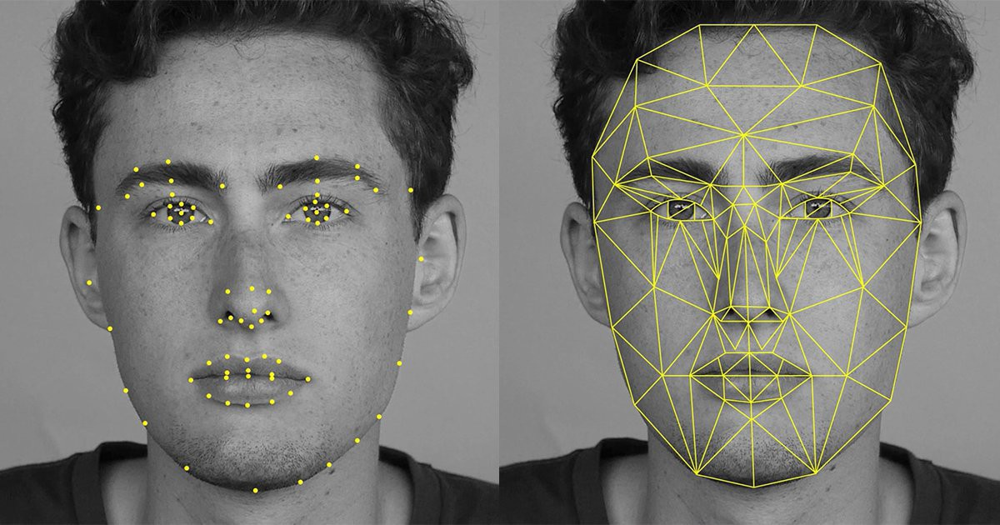
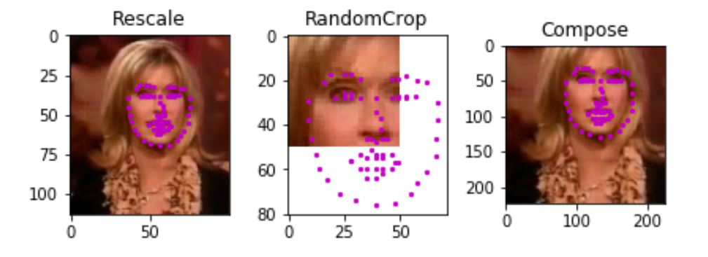
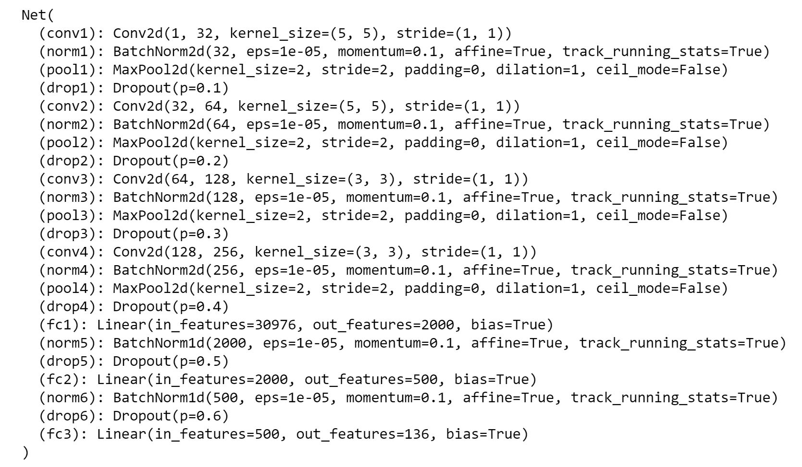
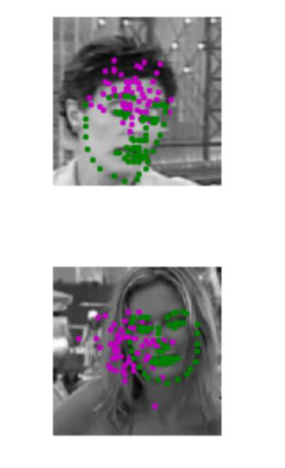
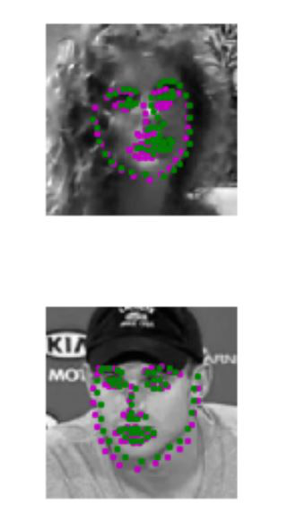
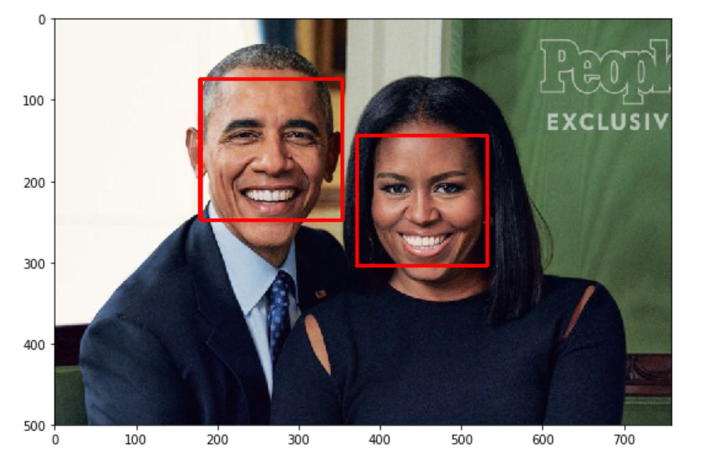
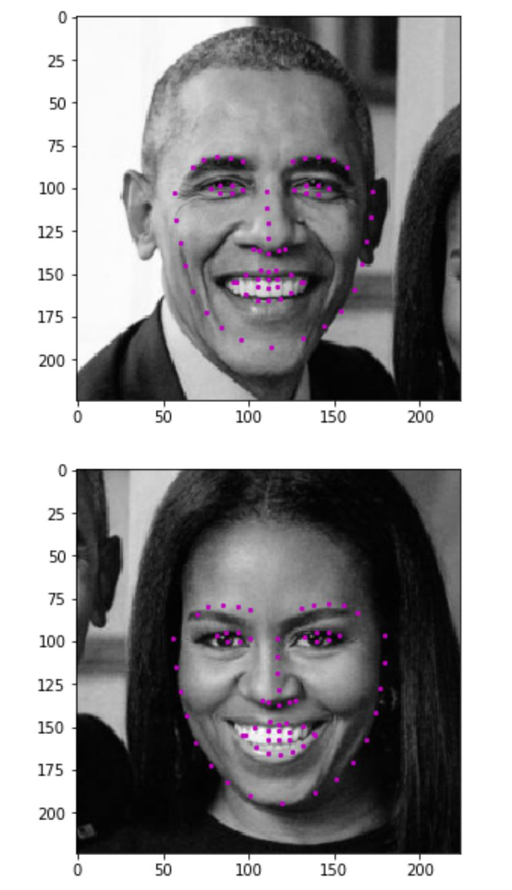

# Facial Keypoint Detection

## Objective

In this project, my objective is to detect 68 facial keypoints of a human face by training a custom CNN model in PyTorch on the YouTube Faces Dataset. The given task is a regression problem which is to locate and allign all the keypoints on a human face.

## Project Walkthrough

### 1. Dataset Exploration and Transformation:

##### What are facial keypoints?

Facial keypoints (also called facial landmarks) mark important areas of the face: the eyes, corners of the mouth, the nose, etc. These keypoints are relevant for a variety of tasks, such as face filters, emotion recognition, pose recognition, and so on. Here they are, numbered, and you can see that specific ranges of points match different portions of the face.

Here I have used the [YouTube Faces Dataset](https://www.cs.tau.ac.il/~wolf/ytfaces/). It consists of 5770 color images. All of these images are separated into either a training or a test set of data.

3462 of these images are training images
2308 are test images

 In each training and test image, there is a single face and `68 keypoints`, with coordinates (x, y), for that face.
 
##### Data Transformations:
 
 Neural networks often expect images that are standardized; a fixed size, with a normalized range for color ranges and coordinates, and (for PyTorch) converted from numpy lists and arrays to tensors. Therefore I have created 4 functions which will help in the required transformations:
 
 
 
-  ``Normalize``: to convert a color image to grayscale values with a range of [0,1] and normalize the keypoints to be in a range of about [-1, 1]
-  ``Rescale``: to rescale an image to a desired size.
-  ``RandomCrop``: to crop an image randomly.
-  ``ToTensor``: to convert numpy images to torch images.

### 2. Training the Network:

After exploring and transforming the data, in this case, getting to know the shapes of the images and of the keypoints, I have now defined a convolutional neural network that can learn from this data.

My CNN Network Architecture:

Please see the `models.py` file for the code.

Results on images before training:

Results on images after training:

### 3. Inference:

For testing the model, I have first taken a random image and I have detected faces in it using Haar Cascade Classifier for face detection in the image:

The final step is to grayscale the image and pass it through our model for inference:

### 4. Fun with keypoints:

In the final notebook, I have played around with the image with all the keypoints detected. For fun, I have just cropped the eyes part of the face and replaced it with glasses as you can see below:

## Conclusion:

I have successfully completed the objective to detect all the 68 keypoints on the images with a Smooth L1 Loss of 0.035

